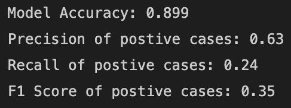

# subscription binary prediction

## Dataset:
You will be given the public dataset from UCI Machine learning repository about the marketing https://archive.ics.uci.edu/ml/datasets/bank+marketing which is trying to predict if the client will subscribe (yes/no) a term deposit (variable y)
#
#
## Attribute Information: Input variables:
### bank client data:
- 1 - age (numeric)
- 2 - job : type of job (categorical: 'admin.','blue-collar','entrepreneur','housemaid','management','retired','self-employed','services','student','technician','unemployed','unknown')
- 3 - marital : marital status (categorical: 'divorced','married','single','unknown'; note: 'divorced' means divorced or widowed)
- 4 - education (categorical: 'basic.4y','basic.6y','basic.9y','high.school','illiterate','professional.course','university.degree','unknown')
- 5 - default: has credit in default? (categorical: 'no','yes','unknown')
- 6 - housing: has housing loan? (categorical: 'no','yes','unknown')
- 7 - loan: has personal loan? (categorical: 'no','yes','unknown')
### related with the last contact of the current campaign:
- 8 - contact: contact communication type (categorical: 'cellular','telephone') 
- 9 - month: last contact month of year (categorical: 'jan', 'feb', 'mar', ..., 'nov', 'dec')
- 10 - day_of_week: last contact day of the week (categorical: 'mon','tue','wed','thu','fri')
- 11 - duration: last contact duration, in seconds (numeric). Important note: this attribute highly affects the output target (e.g., if duration=0 then y='no'). Yet, the duration is not known before a call is performed. Also, after the end of the call y is obviously known. Thus, this input should only be included for benchmark purposes and should be discarded if the intention is to have a realistic predictive model.
### other attributes:
- 12 - campaign: number of contacts performed during this campaign and for this client (numeric, includes last contact)
- 13 - pdays: number of days that passed by after the client was last contacted from a previous campaign (numeric; 999 means client was not previously contacted)
- 14 - previous: number of contacts performed before this campaign and for this client (numeric)
- 15 - poutcome: outcome of the previous marketing campaign (categorical: 'failure','nonexistent','success')
### social and economic context attributes
- 16 - emp.var.rate: employment variation rate - quarterly indicator (numeric)
- 17 - cons.price.idx: consumer price index - monthly indicator (numeric) 
- 18 - cons.conf.idx: consumer confidence index - monthly indicator (numeric) 
- 19 - euribor3m: euribor 3 month rate - daily indicator (numeric)
- 20 - nr.employed: number of employees - quarterly indicator (numeric)

### Output variable (desired target):
- 21 - y - has the client subscribed a term deposit? (binary: 'yes','no')
#
## Questions:
1) Give us your suggestion on how you would make the data better/more useful (E.g. how to do
feature engineering and how features could be enhanced with domain knowledge) and get any actionable business insight for it? 2) With the dataset, could you come up with a scientific approach for analysis/modeling? (e.g.
How you conduct a modeling/design experiment and testing. How to evaluate your work with your chosen dataset. You need to explain why you choose this approach and the evaluation metrics)
#
## Solution:
The most straight forward solution for distinguishing those who's likely to subscribe for High-yield savings from the rest is to
frame it as a binary classification problem - likely to subscribe ("yes" or positive case)  and unlikely ("no" or negative case)

### A) Exploratory Data Analysis

1) row count: 41,188
2) check null values: no rows with null values
3) continuous variables: check outliers. It's cleaner to to set a cap to extreme values before standardization. Standard Scaler need to be saved for applying to new data as well.
4) discreet/categorical variables: check missing or unknown data. Some unknown is genuine such as default payment data which makes sense as the customer might default on loan with other creditors. Other unknown in other data points need to be imputed. The best guess could come from mode value in each cohort. Cohort can be constructed from life_stage (broad age group) and job/ education.

### B) What can be used as model features

1) drop feature that cannot be known before this campaign's attempt: duration

2) some features are accumulated count of both historical data and this campaign's attempt. In 'previous', we can assume that in this campaign, customers were contacted once, hence we can substract number by 1 to arrive at times customers were previously contacted prior to this campaign.

3) drop feature that won't lead to actionable insights: month and day_of_week as you cannot tell campaign managers to only conduct campaign on certain days of the week and certain months

4) drop categorical variable which penetration of "yes" case are indifferent in each variation: Chi-square test shows that we cannot reject that with or without loan penetration of "yes" case in both cohorts is roughly the same, hence we can drop feature 'loan'

5) contunuous variables especially economics factors are highly correlated. Though having correlated variables would not cause much bias in tree-based classifier, they could cause multicolinearity in formula-based classifier like Logistic Regression ot Stochastic Gradient Descent, hence we can remove them first. We might revisit them again if model performance is not as good as expected. To decide what to keep and what to drop, we keep only those features with highest correlation to target variable. The rest in the highly correlated group, we can drop - 'emp_var_rate', 'euribor3m' in this case.

### C) Preprocessing Transformation

1) we can use pipeline to note down all preprocessing done to the features
2) continuous features: we use standard scaler to normalize
3) ordinal features: like 'education', 'default', 'housing', 'poutcome'; we can use OrdinalEncoder to make them an index, preserving order of each variation like 'university.education' is more than 'high.school'
4) categorical features: we use OneHotEncoder to dummify them into multiple binary features. Here higher number of variations might be less meaningful to 3-5 variations. F-score can come to the rescue in collapsing variations of feature like 'job', if model result is not good enough.
#

#
### D) Binary Classification Model Training

1) split model into Train - Test datasets. 80%-20% in this case. Split was done by stratified sampling.

2) Setup hyperparameter of classifiers we plan to use - GradientBoostingClassifier and RandomForestClassifier in this case. Bagging and Boosting ensembles usually gives low-bias results and are less tricky in dealing with continuous, ordinal and categorical features at the same time
If result isn't convincing, we might try other classifiers. 

##### GBC - 1000 estimators, 3 max depth, 8 and 10 minimum members in leaf, learning rate: 10%, 5%, 3%, 1%

##### RFC - 1000 estimators, 4-6 max depth, 8 and 10 minimum members in leaf, max features allowed for each estimator: 'sqrt' - square-root of total features
#
### E) Classifiers' KPIs: Accuracy, ROC curve, Kolmogorov Smirnov value, Lift Chart
#
### Gradient Boosting Classifier
#

#
### Random Forest Classifier
#

#
from both classifiers'results. GBC would give higher numbers of customers likely to subscribe to high-yield saiving - high recall at a cost of lower precision. In this situation, there's not much down side in being less precise (customers turning down offer), hence higher recall should be encouraged.
#
#
### F) Model interpretation: Gradient Boosting Classifier
#

number of employed (economics factor), historical campaign outcome, consumer's confidence index, consumer's price index (cpi) and age are the most important features
#

1) the higher people employed in the economy, the better climate for high-yield savings subscription

2) 'success', 'nonexistent', 'failure' in historical campaign results, in that order, yield favourable outcome for high-yield savings subcription in this campaign. 'success' yields best result

3) the lower consumer's confidence index, the better climate for high-yield savings subscription

4) the lower consumer's price index, the better climate for high-yield savings subscription

5) younger customers and older customers are more likely to subscribe. Not the middle age customers (mid 30s to late 40s)
